# Diagramas de Arquitectura y Flujo de Datos - Supply Chain Tracker

## 1. Arquitectura General del Sistema

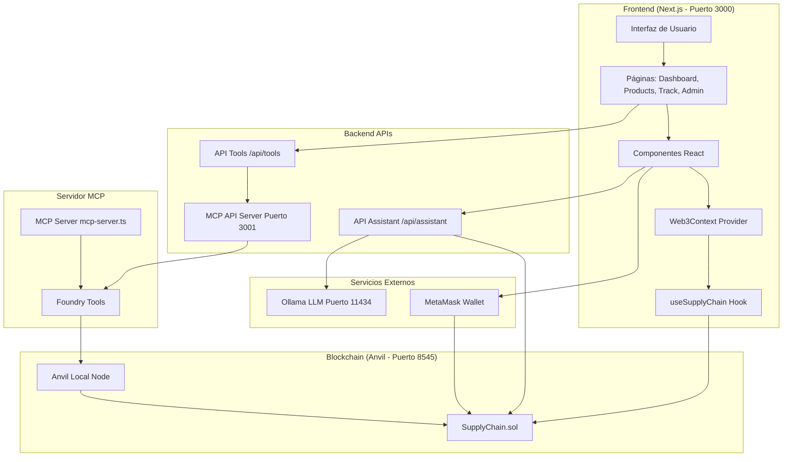

## 2. Arquitectura de Smart Contract

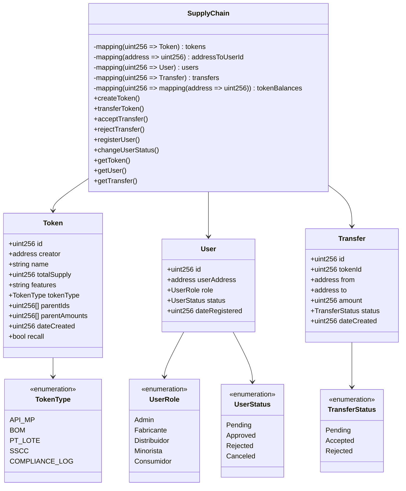

## 3. Flujo de Datos - Creación de Token

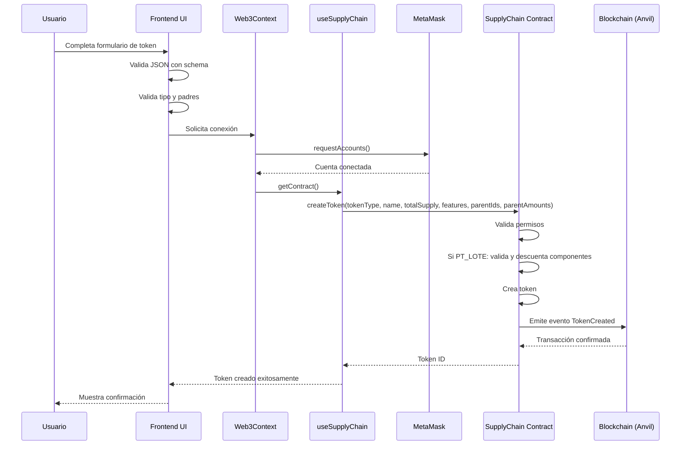

## 4. Flujo de Datos - Transferencia de Token

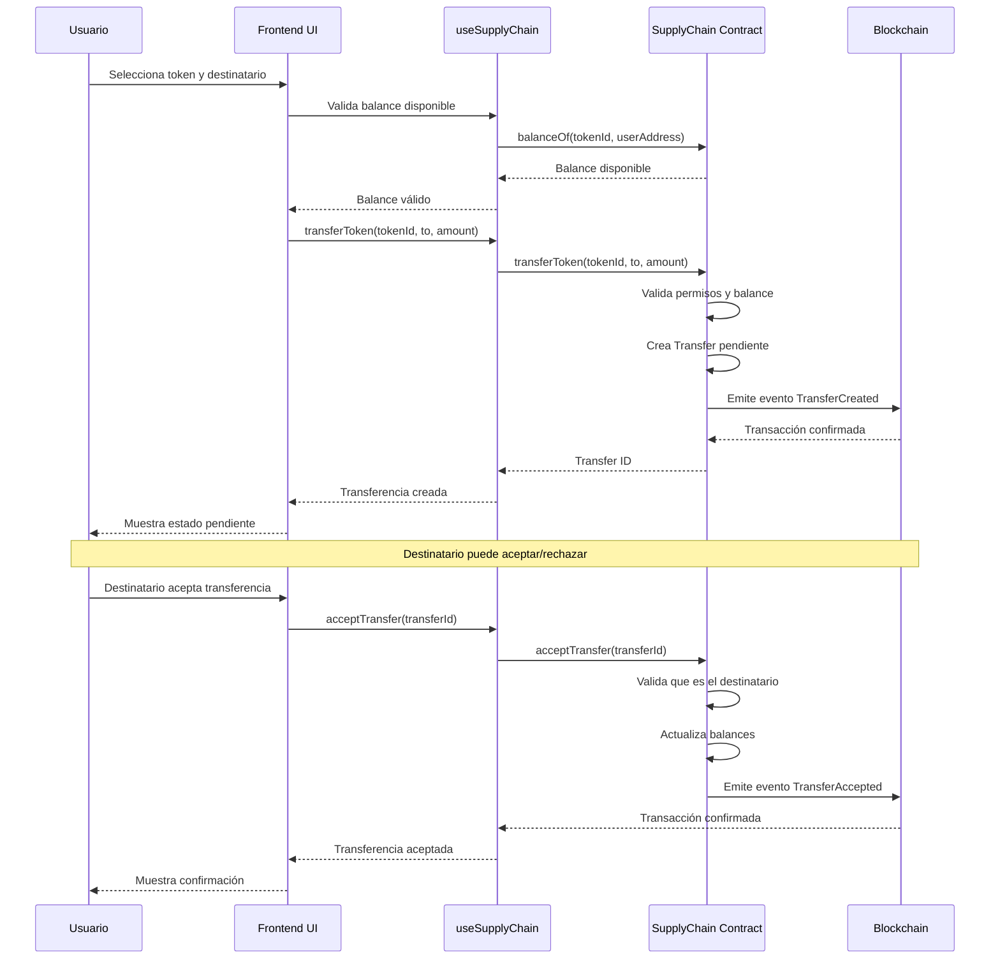

## 5. Flujo de Datos - Asistente de IA

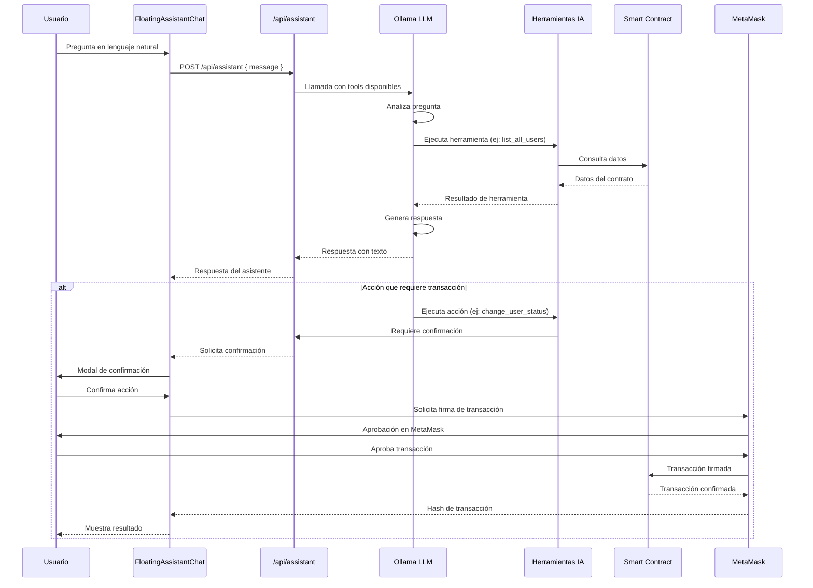

## 6. Arquitectura de Componentes Frontend

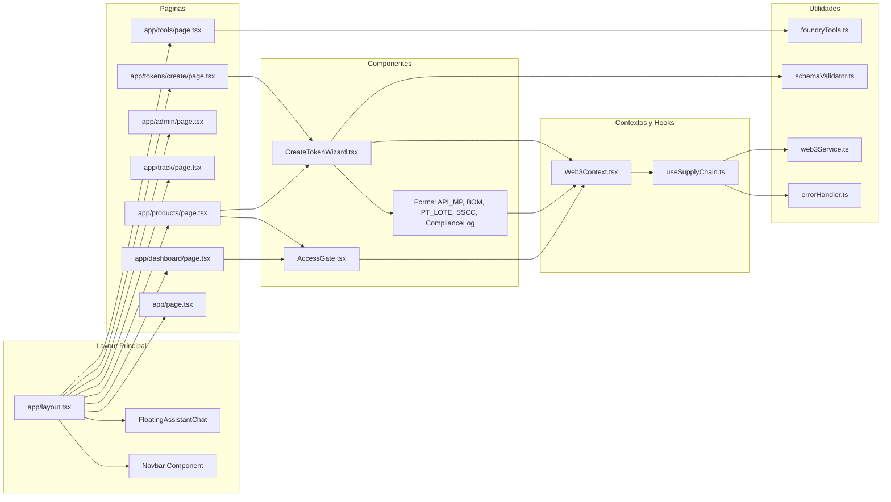

## 7. Flujo de Jerarquía de Tokens

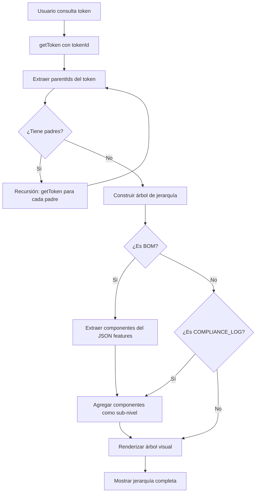

## 8. Sistema de Roles y Permisos

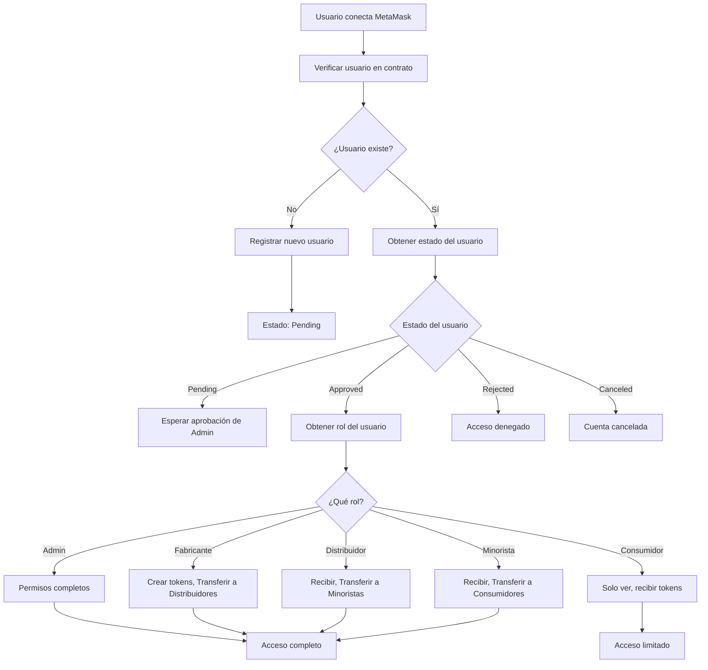

## 9. Flujo de Descuento Automático de Supply (PT_LOTE)

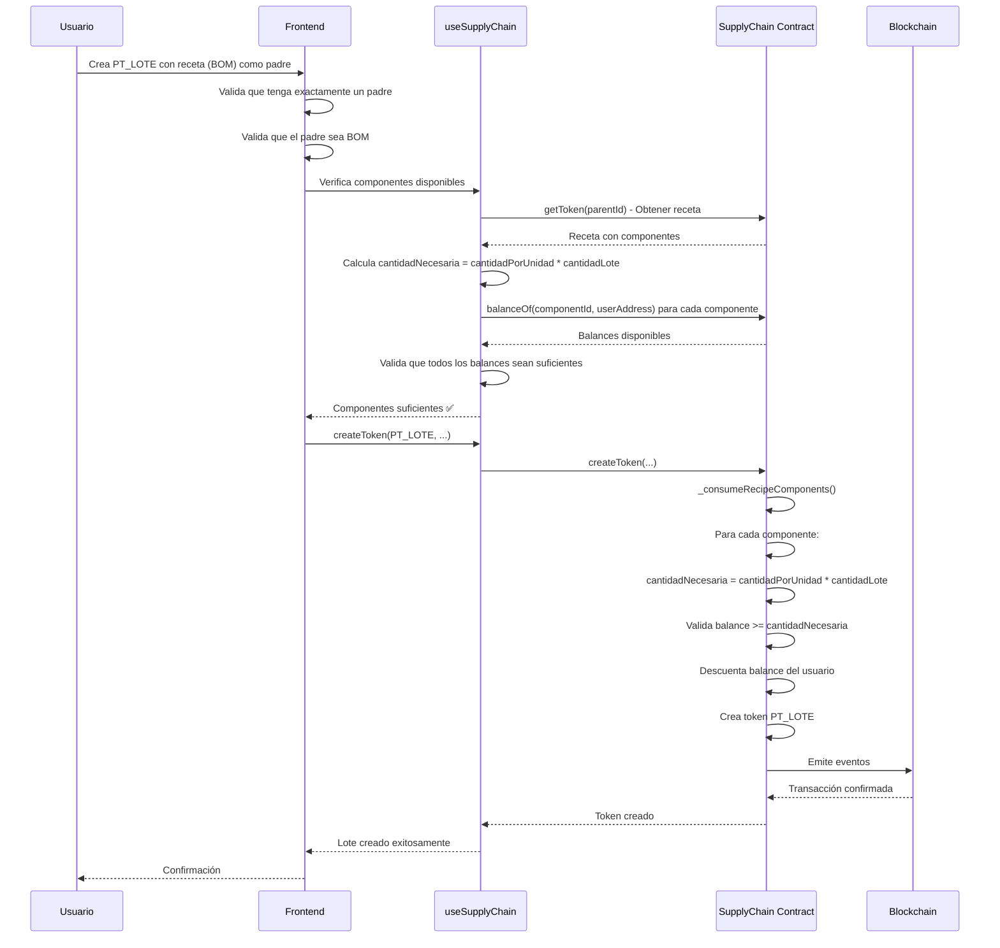

## 10. Arquitectura del Servidor MCP

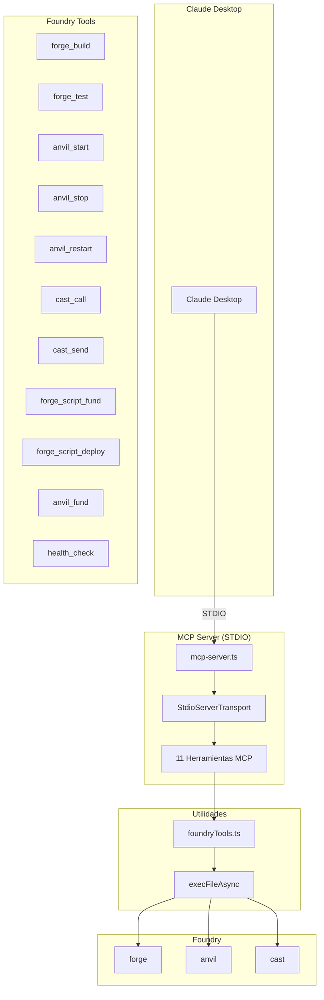

## 11. Flujo de Datos Completo - Sistema de Trazabilidad

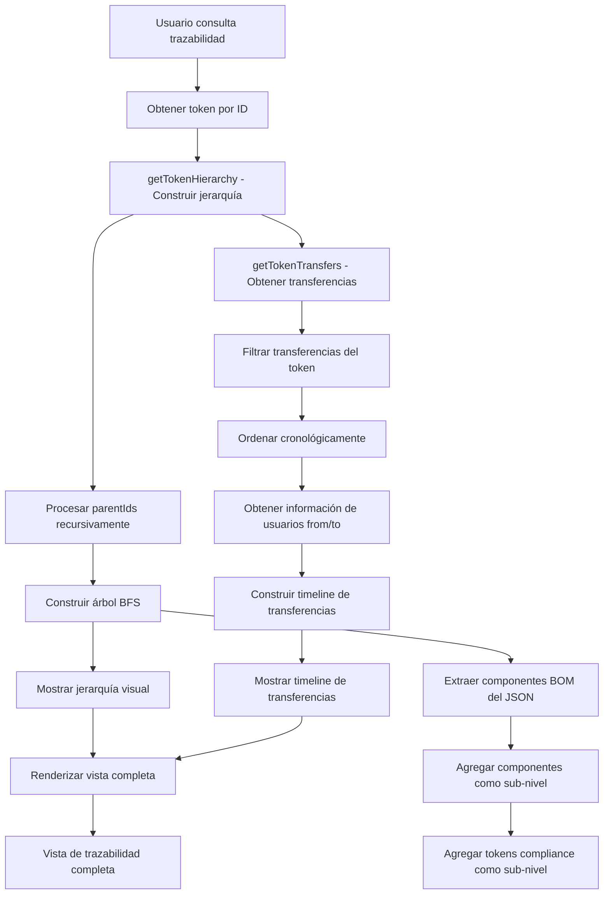

## 12. Arquitectura de Validaciones

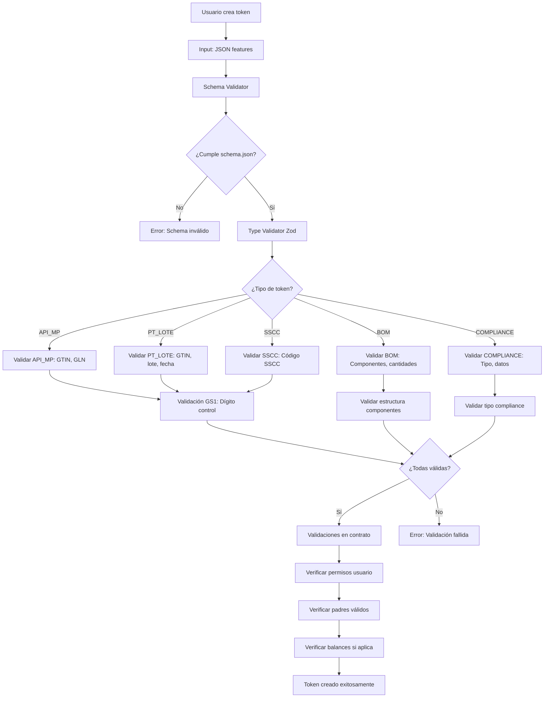

## 13. Flujo de Sistema de Recall

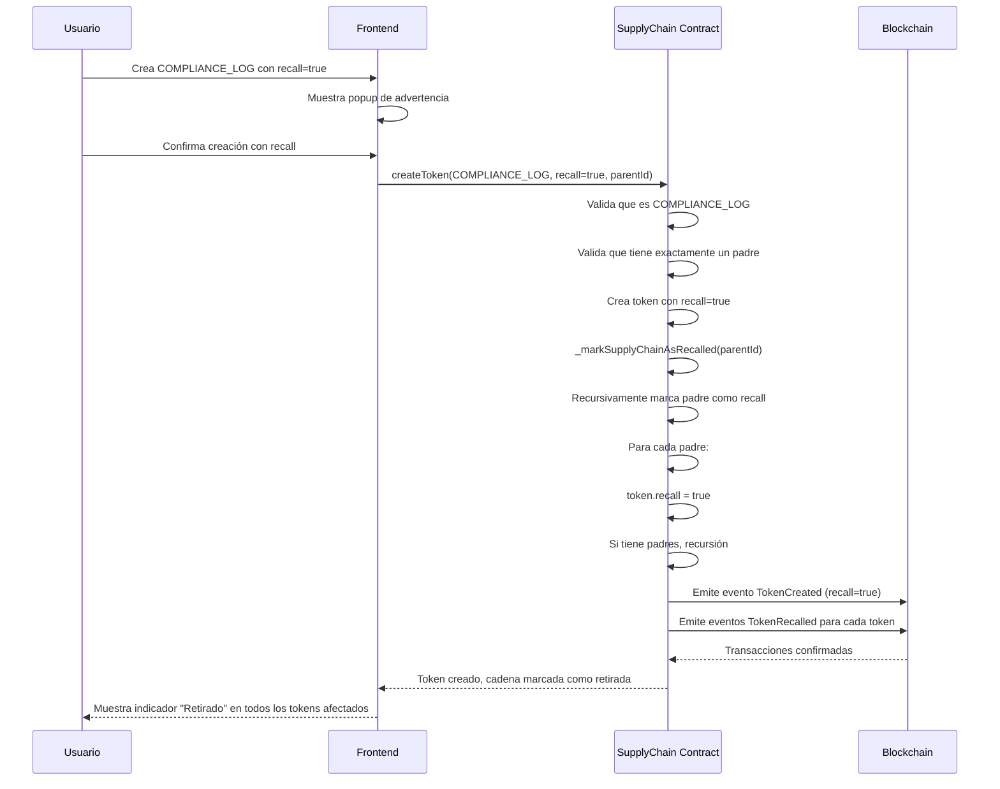

## 14. Arquitectura de APIs

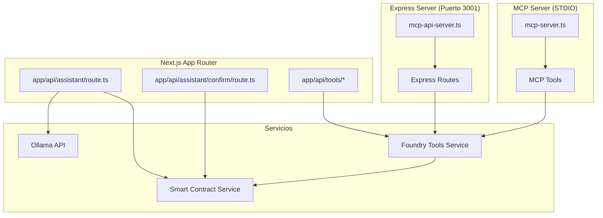

## 15. Flujo de Autenticación y Autorización

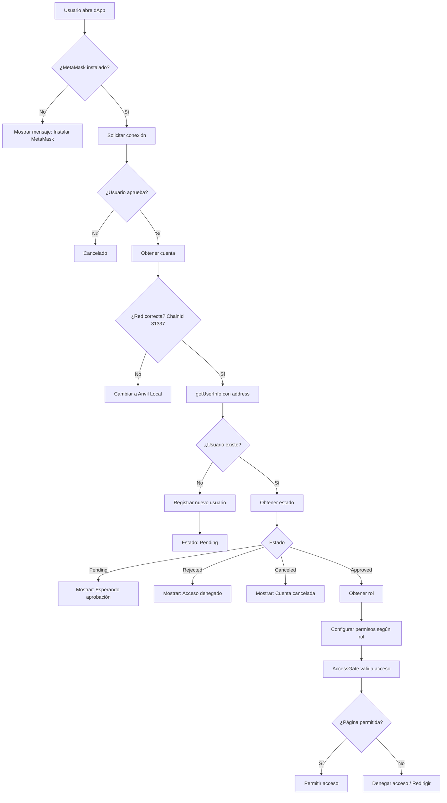

---

*Diagramas generados para el proyecto Supply Chain Tracker*  
*Última actualización: Enero 2025*
