# Supply Chain Tracker - dApp

Aplicación descentralizada (dApp) para gestionar de manera completa una cadena de suministros farmacéutica utilizando tecnología blockchain. Implementa trazabilidad completa de productos desde materia prima hasta el consumidor final.

## 🎯 Caso de Uso

Sistema de trazabilidad para cadena de suministro farmacéutica en Chile (MVP), que permite:
- Registro de materias primas (API/excipientes)
- Composición de productos (BOM)
- Gestión de lotes de producción
- Control logístico con códigos SSCC
- Registros de cumplimiento (temperatura, CAPA, recalls)

## 🛠️ Tecnologías

### Smart Contracts
- **Solidity** ^0.8.24
- **Foundry** - Framework de desarrollo y testing
- **Anvil** - Nodo local de Ethereum

### Frontend
- **Next.js** 14 - Framework React con App Router
- **TypeScript** - Tipado estático
- **Tailwind CSS** - Estilos utilitarios
- **ethers.js** v6 - Interacción con Ethereum
- **Zod** - Validación de esquemas
- **Express.js** - Servidor API para herramientas MCP (puerto 3001)
- **tsx** - Ejecución de TypeScript para servidor Express

## 📁 Estructura del Proyecto

```
supply-chain-tracker/
├── sc/                              # Smart Contracts
│   ├── src/
│   │   └── SupplyChain.sol          # Contrato principal
│   ├── script/
│   │   ├── Deploy.s.sol             # Script de despliegue
│   │   └── FundAccounts.s.sol       # Script para fondear cuentas
│   ├── test/
│   │   └── SupplyChain.t.sol        # Tests del contrato (50 tests)
│   └── foundry.toml                 # Configuración de Foundry
├── web/                             # Frontend Next.js
│   ├── src/
│   │   ├── app/                     # Páginas (App Router)
│   │   │   ├── admin/               # Panel de administración
│   │   │   ├── dashboard/           # Dashboard principal
│   │   │   ├── products/            # Gestión de tokens
│   │   │   ├── tokens/create/       # Wizard de creación
│   │   │   └── track/               # Trazabilidad completa
│   │   ├── components/              # Componentes React
│   │   │   ├── AccessGate.tsx       # Control de acceso
│   │   │   ├── Navbar.tsx           # Navegación
│   │   │   └── tokens/              # Componentes del wizard
│   │   ├── types/                   # Tipos TypeScript
│   │   │   └── pharma.ts            # Tipos para tokens pharma
│   │   ├── validators/              # Validadores Zod
│   │   │   └── pharma.ts            # Validaciones GS1 y regulatorias
│   │   ├── builders/                # Constructores de features
│   │   │   └── pharma.ts            # Builders por tipo de token
│   │   ├── schemas/                 # Schemas JSON
│   │   │   └── features.schema.json # Schema de validación de features
│   │   └── lib/
│   │       ├── errorHandler.ts       # Manejador de errores Web3/MetaMask
│   │       └── schemaValidator.ts   # Validador de JSON schema
│   │   ├── contexts/                # Contextos React
│   │   │   └── Web3Context.tsx      # Provider Web3
│   │   ├── hooks/                   # Custom hooks
│   │   │   └── useSupplyChain.ts    # Hook del contrato
│   │   ├── contracts/               # ABI y configuración
│   │   ├── app/
│   │   │   ├── tools/               # Interfaz MCP Tools (disponible en /tools)
│   │   │   └── api/tools/           # API routes (deprecated, usar server/)
│   │   └── lib/                     # Utilidades
│   ├── server/                      # Servidor Express para APIs MCP
│   │   └── mcp-api-server.ts        # Servidor API (puerto 3001)
│   ├── package.json
│   └── tailwind.config.js
├── chats/                           # Logs de sesiones IA
├── IA.md                            # Retrospectiva del uso de IA
└── README.md
```

## 🚀 Instalación

### Requisitos previos
- Node.js >= 18
- npm >= 9
- Git
- Foundry (forge, anvil, cast)
- MetaMask

### 1. Clonar el repositorio
```bash
git clone <url-del-repo>
cd supply-chain-tracker
```

### 2. Configurar Smart Contracts
```bash
cd sc
forge install
forge build
forge test
```

### 3. Configurar Frontend
```bash
cd web
npm install
```

## 💻 Uso

### Opción 1: Script Automatizado (Recomendado)
```bash
# Inicia todo el ambiente automáticamente
./start-all.sh
```

Este script:
1. Inicia el servidor MCP API (puerto 3001)
2. Compila los smart contracts
3. Inicia Anvil (blockchain local)
4. Despliega el contrato automáticamente
5. Actualiza la dirección del contrato en los archivos de configuración
6. Fondea las cuentas de prueba
7. Inicia el frontend (puerto 3000)

### Opción 2: Manual

#### 1. Iniciar nodo local (Anvil)
```bash
# En una terminal
anvil
```

#### 2. Desplegar contratos
```bash
cd sc
forge script script/Deploy.s.sol --rpc-url http://127.0.0.1:8545 --broadcast
```

#### 3. Fondear cuentas de prueba (opcional)
```bash
# Desde sc/
forge script script/FundAccounts.s.sol --rpc-url http://127.0.0.1:8545 --broadcast

# O directamente con cast:
cast send <direccion> --value 10ether --private-key 0xac0974bec39a17e36ba4a6b4d238ff944bacb478cbed5efcae784d7bf4f2ff80 --rpc-url http://127.0.0.1:8545
```

#### 4. Actualizar dirección del contrato
Copiar la dirección del contrato desplegado y actualizar en:
- `web/src/contracts/SupplyChain.ts` → `CONTRACT_ADDRESS`
- `web/.env.local` → `CONTRACT` y `NEXT_PUBLIC_CONTRACT`

#### 5. Iniciar servidor MCP (opcional)

**Servidor MCP Real (para Claude Desktop):**
```bash
cd web
npm run start:mcp-server
# O usando npx directamente:
npx -y tsx server/mcp-server.ts
```
📖 Ver documentación de Claude Desktop para configurar MCP servers

**API REST Legacy (para interfaz web `/tools`):**
```bash
cd web
npm run start:mcp-api
```

#### 6. Iniciar frontend
```bash
cd web
npm run dev
```
Abrir http://localhost:3000

#### 7. Iniciar Ollama (para Asistente de IA)
```bash
ollama serve
# Verificar que el modelo esté disponible:
ollama list
# Si falta, descargarlo:
ollama pull llama3.2
```

### 6. Configurar MetaMask
1. Agregar red Anvil Local:
   - RPC URL: `http://127.0.0.1:8545`
   - Chain ID: `31337`
   - Símbolo: `ETH`
2. Importar cuenta de prueba usando clave privada de Anvil

## 📋 Funcionalidades

### Roles de Usuario
| Rol | Descripción | Permisos |
|-----|-------------|----------|
| 🏭 Fabricante | Produce productos | Crear tokens, transferir a distribuidores |
| 🚚 Distribuidor | Transporta productos | Recibir, transferir a minoristas |
| 🏪 Minorista | Vende al consumidor | Recibir, transferir a consumidores |
| 👤 Consumidor | Usuario final | Recibir tokens, verificar trazabilidad (sin crear ni transferir) |
| 👑 Admin | Administrador | Aprobar usuarios, transferir a cualquier rol |

### Tipos de Token Pharma
| Tipo | Descripción | Ejemplo | Notas |
|------|-------------|---------|-------|
| API_MP | Materia Prima / API | Paracetamol USP | Puede tener múltiples padres opcionales |
| BOM | Bill of Materials | Receta del producto | Define componentes y cantidades necesarias |
| PT_LOTE | Producto Terminado | Lote de comprimidos | **Requiere exactamente un padre (receta/BOM). Descuenta automáticamente los componentes de la receta al crear el lote** |
| SSCC | Unidad Logística | Pallet con productos | **Requiere exactamente un padre (PT_LOTE). Descuenta automáticamente unidades del lote al crear la unidad logística** |
| COMPLIANCE_LOG | Registros | TempLog, CAPA, Recall | Puede tener múltiples padres opcionales. **Puede marcar recall para retirar productos del mercado** |

### Páginas

#### 🏠 Home (`/`)
Landing page con información del proyecto.

#### 📊 Dashboard (`/dashboard`)
- **Totalizadores personalizados por rol**:
  - **Admin**: Total Tokens, Total Usuarios, Total Transferencias, Mi Estado
  - **Fabricante/Distribuidor/Retailer**: Mis Tokens, Transferencias Enviadas, Transferencias Recibidas, Mi Estado
  - **Consumidor**: Mis Tokens, Transferencias Recibidas, Mi Estado
- Tokens del usuario con **indicador de "Retirado"** si están en recall
- **Icono de información para consumidores** sobre productos retirados
- Transferencias pendientes

#### 📦 Productos (`/products`)
- Lista de tokens propios con **indicador de "Retirado"** si están en recall
- Crear tokens (formulario simple con validación JSON obligatoria)
- **Selección de tipo de token** y **múltiples padres con cantidades**
- **Checkbox de Recall** para tokens COMPLIANCE_LOG:
  - Solo visible cuando el tipo seleccionado es COMPLIANCE_LOG
  - **Popup de advertencia** antes de crear token con recall
  - Explica que se retirará toda la cadena de suministro relacionada
- **Validaciones mejoradas para PT_LOTE**:
  - Debe tener exactamente un padre (receta/BOM)
  - Verificación previa de componentes suficientes antes de crear el lote
  - Mensajes descriptivos si faltan componentes
- **Transferir tokens con combobox de destinatarios filtrado por rol según cadena de suministro**
- **Validación de balance con popup de error**
- **Restricción de transferencia**: No se pueden transferir tokens retirados (recall)
- **Restricciones por rol**: Consumidores solo pueden ver sus tokens (sin crear ni transferir)

#### ➕ Crear Token (`/tokens/create`)
Wizard multi-paso para crear tokens farmacéuticos:
1. Selección de tipo
2. Formulario específico con validaciones
3. Revisión del JSON generado
4. Confirmación y creación en blockchain

#### 🔍 Trazabilidad (`/track`)
Vista completa de un token:
- **Información**: Detalles y características con descripción de tipos
  - **Indicador de "Retirado"** si el token está en recall
  - **Icono de información para consumidores** con explicación sobre productos retirados
- **Jerarquía**: 
  - Árbol visual de tokens padre
  - **Todos los padres de un BOM se muestran en el mismo nivel** (BFS)
  - **Componentes BOM mostrados como sub-nivel bajo cada BOM** (materias primas)
  - **Tokens compliance como sub-nivel** (morado)
  - **Indicador de "Retirado"** en cada item de la jerarquía
- **Transferencias**: Timeline cronológico con perfil de cuentas
- **Botón "Volver"** según historial de navegación

#### ⚙️ Admin (`/admin`)
Panel de administración:
- Lista paginada de usuarios (10/50/100)
- Filtro por estado
- Búsqueda por dirección
- Acciones de cambio de estado

#### 🛠️ Herramientas Foundry

**Opción 1: Servidor MCP Real (Recomendado para Claude Desktop)**
- ✅ Implementa protocolo MCP estándar de Anthropic
- ✅ Compatible con Claude Desktop y otros clientes MCP
- ✅ 11 herramientas Foundry disponibles como herramientas MCP
- 🚀 Iniciar con: `cd web && npm run start:mcp-server`

**Opción 2: Interfaz Web (`/tools`)**
- Interfaz web para gestionar herramientas Foundry
- **Health Check**: Verifica estado de herramientas Foundry y Anvil
- **Forge Build**: Compila smart contracts
- **Forge Test**: Ejecuta tests con verbosidad configurable
- **Anvil Restart**: Reinicia Anvil (detiene todos los procesos y inicia uno nuevo)
- **Anvil Start/Stop**: Inicia o detiene Anvil
- **Fondear Cuentas**: Ejecuta script de funding o fonda direcciones específicas
- **Cast Call**: Ejecuta llamadas de solo lectura a contratos
- **Cast Send**: Envía transacciones a contratos
- Frontend disponible en `http://localhost:3000/tools`
- API REST disponible en `http://localhost:3001` (legacy, no es MCP estándar)

#### 🤖 Asistente de IA
Chat flotante disponible en todas las páginas con capacidades completas:
- **Consultas**: Información sobre usuarios, tokens, transferencias y estadísticas del sistema
- **Búsquedas avanzadas**: Filtrado por múltiples criterios (rol Y estado, tipo Y recall, etc.)
- **Explicaciones**: Respuestas sobre el funcionamiento del sistema, tipos de tokens, jerarquía, etc.
- **Acciones**: Ejecución de acciones sobre el contrato (aprobar usuarios, crear tokens, transferir, etc.)
- **Contexto**: Mantiene contexto de conversación para referencias como "este usuario" o "esta transferencia"
- **Confirmaciones**: Modal de confirmación para transacciones que requieren firma
- **Integración con MetaMask**: Todas las transacciones se firman con la cuenta conectada del usuario en MetaMask

**Herramientas disponibles para la IA**:
- Consulta: `get_token_status`, `list_all_tokens`, `get_user_info`, `list_all_users`, `get_transfer_info`, `list_all_transfers`, `get_user_tokens`, `get_user_transfers`, `get_system_stats`
- Acciones: `change_user_status`, `create_token`, `transfer_token`, `accept_transfer`, `reject_transfer`

**Requisitos**:
- Ollama corriendo en `http://127.0.0.1:11434`
- Modelo `llama3.2` disponible (o configurar otro modelo en `.env.local`)
- MetaMask conectado para ejecutar transacciones

## 🧪 Testing

### Smart Contracts
```bash
cd sc
forge test -vvv
```

### Coverage
```bash
forge coverage
```

### Tests incluidos (55 tests)
- Gestión de usuarios (7 tests)
- Creación de tokens (8 tests)
- Transferencias (8 tests)
- Validaciones y permisos (6 tests)
- Casos edge (5 tests)
- Eventos (6 tests)
- Flujos completos (3 tests)
- Tests de robustez (7 tests)
- **Descuento de supply para PT_LOTE (5 tests)**:
  - Consumo correcto de componentes
  - Validación de componentes insuficientes
  - Validación de padre BOM requerido
  - Validación de padre único requerido
  - Consumo de múltiples componentes
- **Sistema de Recall (tests incluidos en creación de tokens)**:
  - Validación de recall solo para COMPLIANCE_LOG
  - Validación de padre único para recall
  - Marcado de cadena de suministro como retirada

## 🔐 Cuenta Admin

En la red local de Anvil, el admin está configurado como:
```
Address: 0xeD252BAc2D88971cb5B393B0760f05AF27413b91
```

Para pruebas, asegúrate de fondear esta cuenta y conectarla a MetaMask.

## 📄 Validaciones

### Validaciones GS1
El sistema implementa validaciones para códigos GS1:
- **GTIN** (14 dígitos) - Global Trade Item Number
- **GLN** (13 dígitos) - Global Location Number
- **SSCC** (18 dígitos) - Serial Shipping Container Code

Todas las validaciones incluyen verificación de dígito de control (Modulo 10).

### Validación de Features JSON
- **Schema validation**: Validación en tiempo real del JSON de features según `features.schema.json`
- **Validación por tipo**: Reglas específicas según el tipo de token (API_MP, BOM, PT_LOTE, SSCC, COMPLIANCE_LOG)
- **Feedback visual**: Indicadores de validación en el formulario de creación

## 🆕 Sistema de Múltiples Padres y Descuento de Supply (Diciembre 2024)

### Cambios en el Contrato
- ✅ **Enum TokenType**: Tipos de token definidos a nivel de contrato (API_MP, BOM, PT_LOTE, SSCC, COMPLIANCE_LOG)
- ✅ **Múltiples padres**: Tokens pueden tener múltiples padres con cantidades asociadas (`parentIds[]` y `parentAmounts[]`)
- ✅ **Descuento automático de supply**: Al crear un PT_LOTE:
  - Valida que tenga exactamente un padre que sea una receta (BOM)
  - Calcula componentes necesarios: `cantidadPorUnidad * cantidadLote`
  - Verifica balances suficientes de todos los componentes
  - Descuenta automáticamente los componentes del balance del creador
  - Revierte con mensaje descriptivo si algún componente es insuficiente

### Cambios en Frontend
- ✅ **Selector de tipo de token** visible en formularios
- ✅ **Múltiples padres con cantidades**: UI mejorada para agregar/remover padres dinámicamente
- ✅ **Validaciones previas**: Verifica componentes suficientes antes de enviar transacción
- ✅ **Mensajes de error descriptivos**: Indica específicamente qué componente falta y cuánto se necesita
- ✅ **Schema JSON actualizado**: Campo `type` removido (ahora es parte del contrato)

## ✨ Mejoras Recientes (Diciembre 2024 - Enero 2025)

### Asistente de IA Integrado (Enero 2025)
- ✅ **Chat flotante**: Disponible en todas las páginas con interfaz moderna
- ✅ **9 herramientas de consulta**: Tokens, usuarios, transferencias, estadísticas
- ✅ **5 herramientas de acción**: Cambiar estado de usuarios, crear tokens, transferir, aceptar/rechazar transferencias
- ✅ **Búsquedas avanzadas**: Filtrado por múltiples criterios simultáneos
- ✅ **Mantenimiento de contexto**: Referencias inteligentes ("este usuario", "esta transferencia")
- ✅ **Confirmaciones de transacciones**: Modal para acciones que requieren firma
- ✅ **Manejo robusto de errores**: Timeouts, detección de conexión, mensajes descriptivos
- ✅ **Integración con Ollama**: Soporte para modelos locales de LLM

## ✨ Mejoras Recientes (Diciembre 2024 - Enero 2025)

### Sistema de Múltiples Padres y Descuento de Supply
- ✅ **Sistema de múltiples padres**: Tokens ahora pueden tener múltiples padres con cantidades asociadas (`parentIds[]`, `parentAmounts[]`)
- ✅ **Enum TokenType**: Tipo de token ahora es un parámetro directo del contrato
- ✅ **Descuento automático de supply**: Al crear un lote (PT_LOTE), el sistema valida y descuenta automáticamente los componentes de la receta
- ✅ **Validación de componentes**: Verificación previa de componentes disponibles antes de crear el lote
- ✅ **Mensajes de error descriptivos**: Feedback claro cuando faltan componentes o cuando la validación falla

### Validaciones y UX (Diciembre 2024)

### Validaciones y UX
- ✅ **Validación JSON obligatoria** al crear tokens (campo requerido con validación completa)
- ✅ Validación de balance en transferencias con popup de error
- ✅ **Combobox de destinatarios filtrado por rol según cadena de suministro**:
  - Admin: Todos los usuarios aprobados (excluyendo su cuenta)
  - Fabricante: Solo distribuidores
  - Distribuidor: Solo minoristas
  - Minorista: Solo consumidores
- ✅ **Dashboard personalizado por rol** con totalizadores específicos
- ✅ **Restricciones para consumidores**: Sin acceso a crear tokens ni transferir

### Visualización
- ✅ **Componentes BOM mostrados como sub-nivel bajo cada BOM** en jerarquía
- ✅ Tokens compliance como sub-nivel en jerarquía
- ✅ Botón "Volver" con historial de navegación
- ✅ Descripción de tipos en JSON (ej: "API_MP (Materia Prima)")
- ✅ Perfil de cuenta en transferencias
- ✅ Formato de destinatarios: `#número (rol)` en lugar de dirección

### Formularios
- ✅ ParentId como lista desplegable de tokens propios
- ✅ Ejemplos de nombres acordes a medicamentos
- ✅ Validación en tiempo real del JSON de features

### Correcciones Técnicas
- ✅ Corrección de comparación de estado de usuario en `getUsersByRole`
- ✅ Corrección de estructura JSON de BOM para visualización correcta de componentes
- ✅ Mejora del parsing de errores del contrato para mostrar mensajes descriptivos
- ✅ Validaciones mejoradas en frontend antes de enviar transacciones

## 📊 Diagramas de Arquitectura y Flujo de Datos

El proyecto incluye diagramas detallados en formato Mermaid que documentan la arquitectura completa y los flujos de datos del sistema. Todos los diagramas se renderizan automáticamente en GitHub.

### 1. Arquitectura General del Sistema

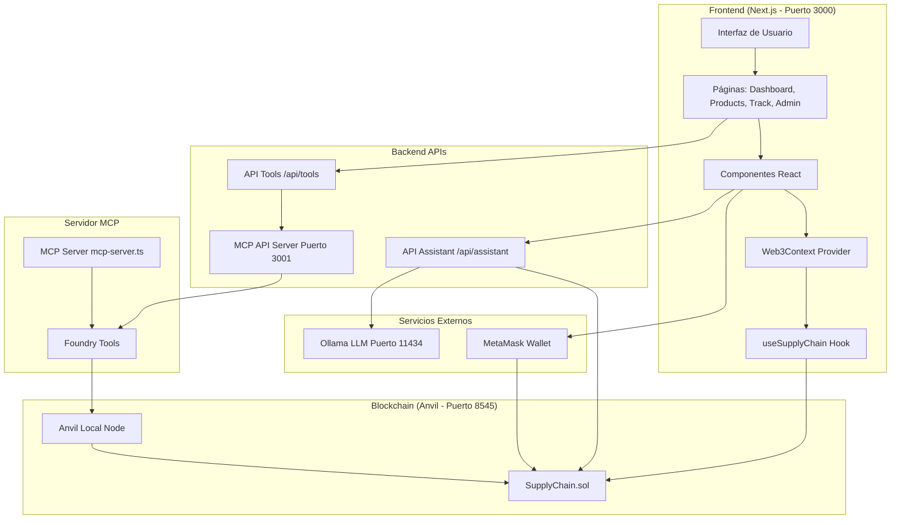

### 2. Arquitectura de Smart Contract

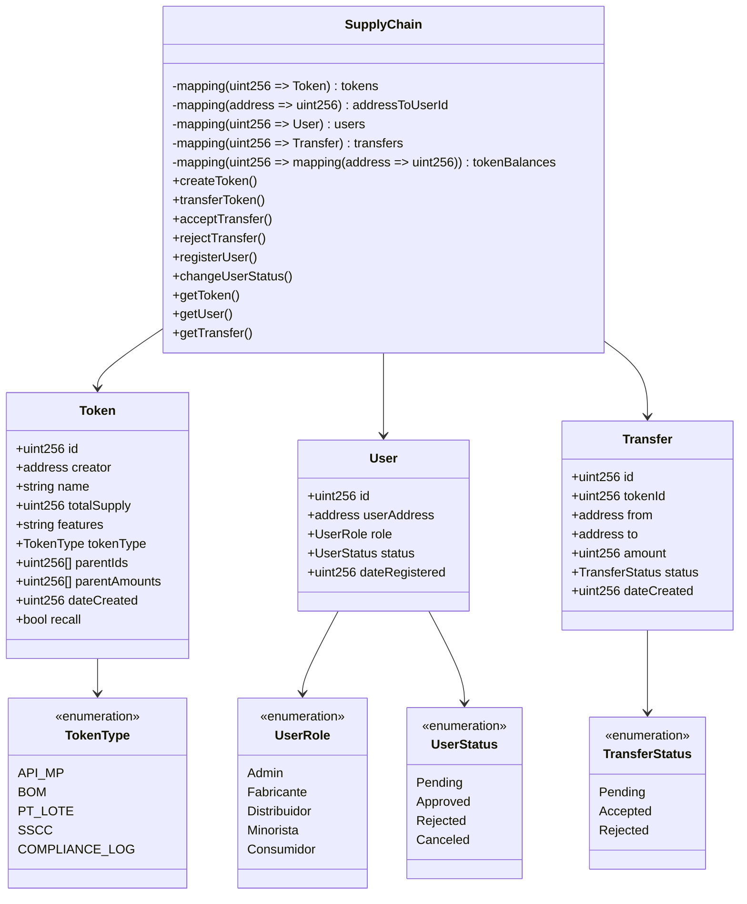

### 3. Flujo de Datos - Creación de Token

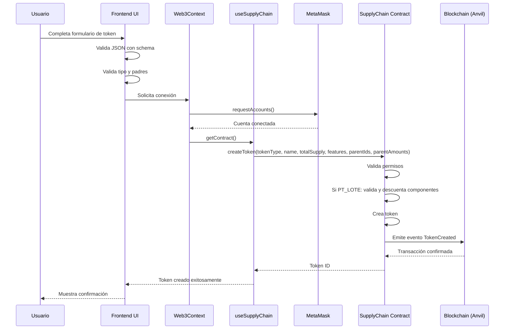

### 4. Flujo de Datos - Transferencia de Token

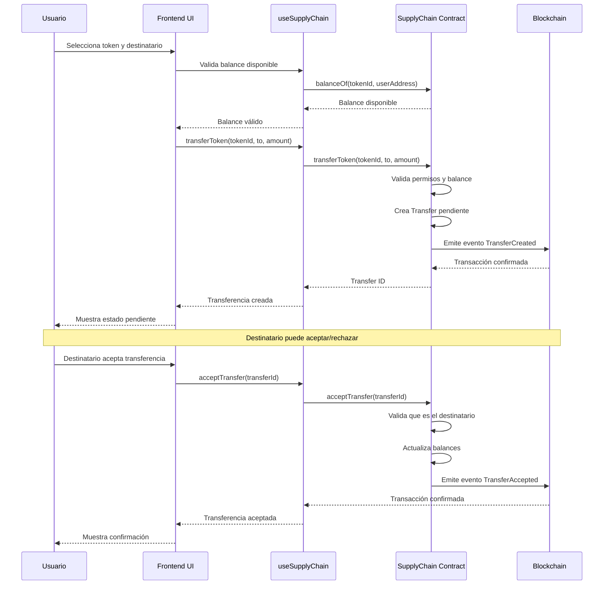

### 5. Flujo de Datos - Asistente de IA

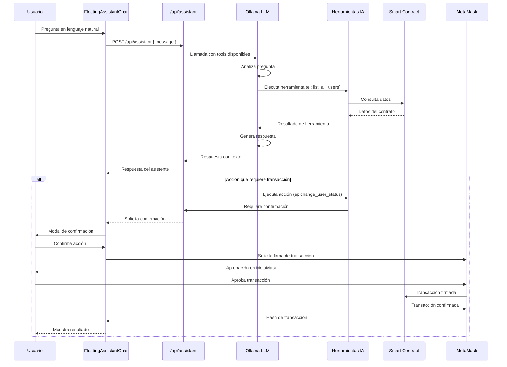

### 6. Arquitectura de Componentes Frontend

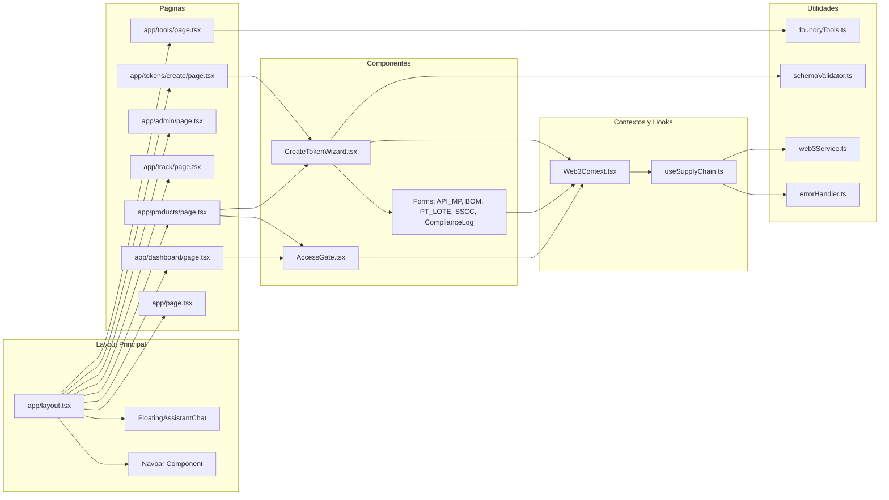

### 7. Flujo de Jerarquía de Tokens

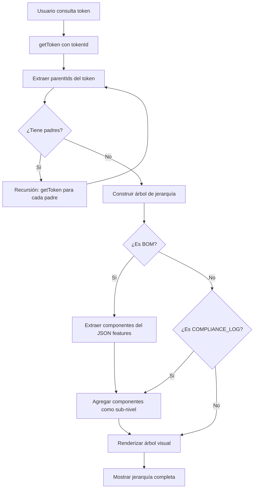

### 8. Sistema de Roles y Permisos

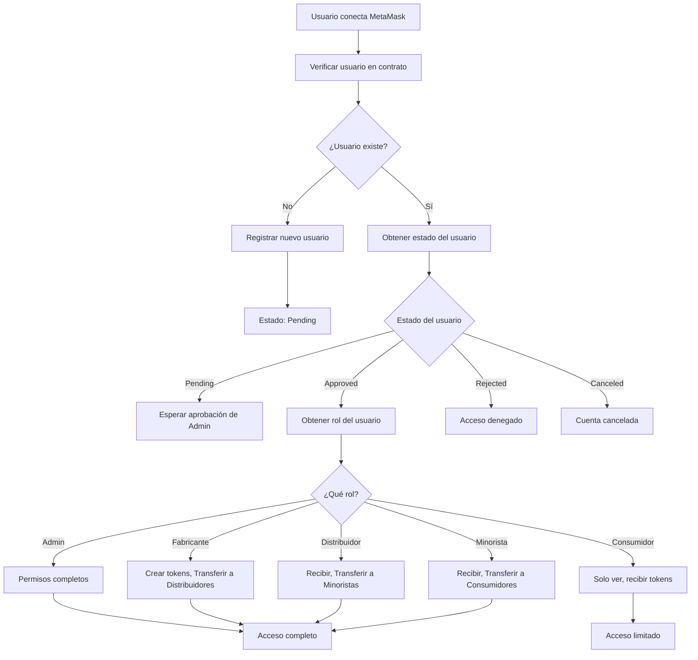

### 9. Flujo de Descuento Automático de Supply (PT_LOTE)

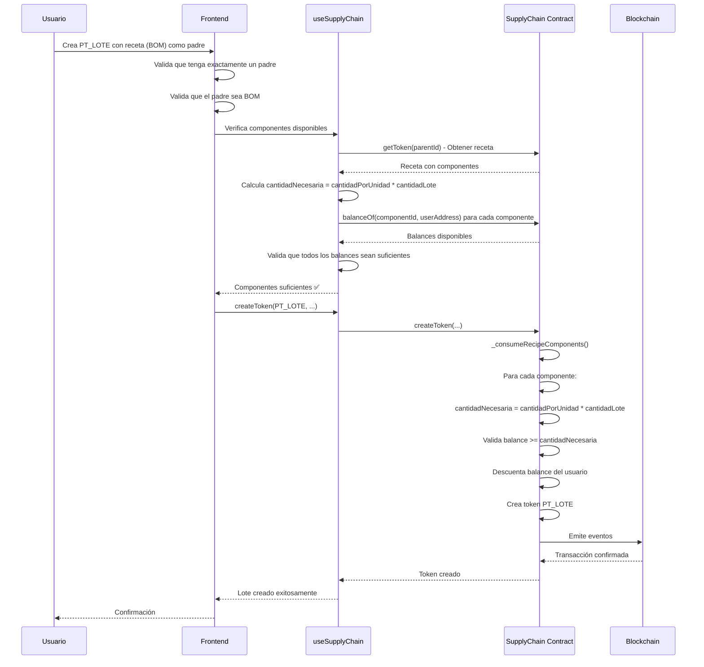

### 10. Arquitectura del Servidor MCP

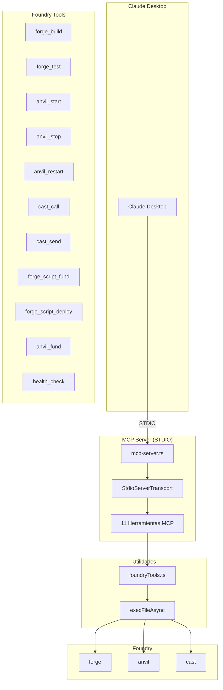

### 11. Flujo de Datos Completo - Sistema de Trazabilidad

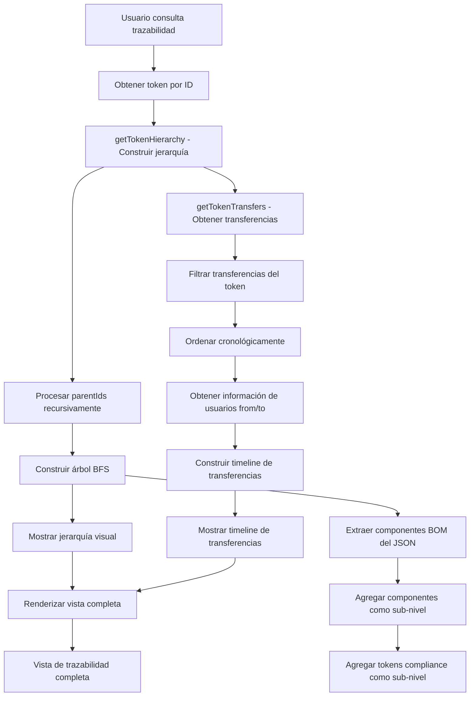

### 12. Arquitectura de Validaciones

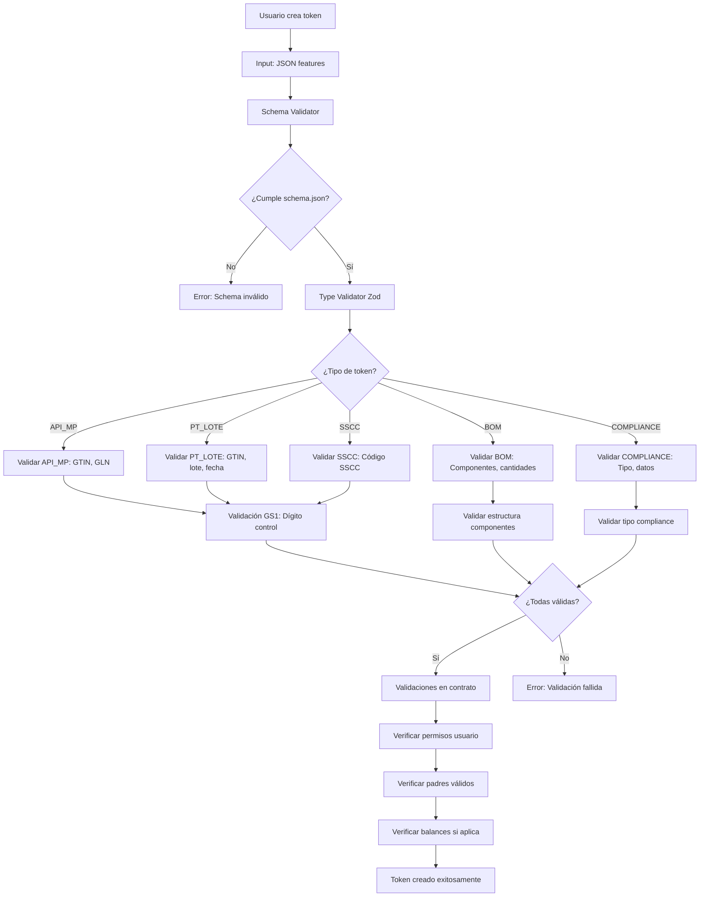

### 13. Flujo de Sistema de Recall

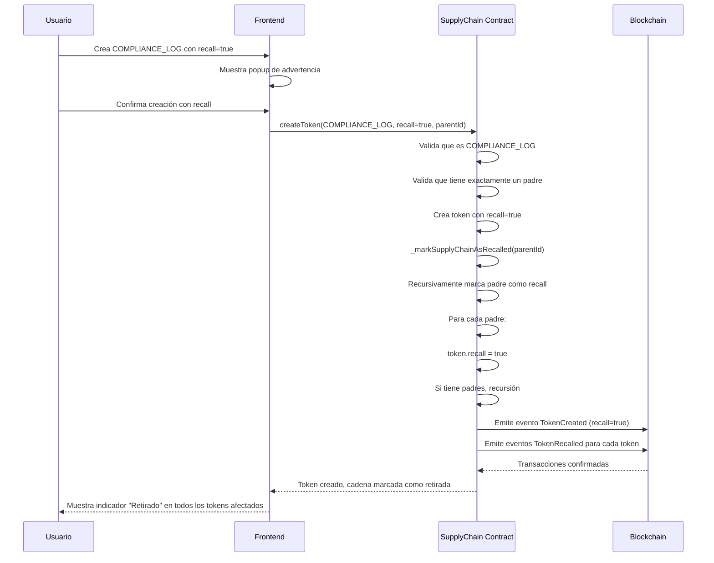

### 14. Arquitectura de APIs

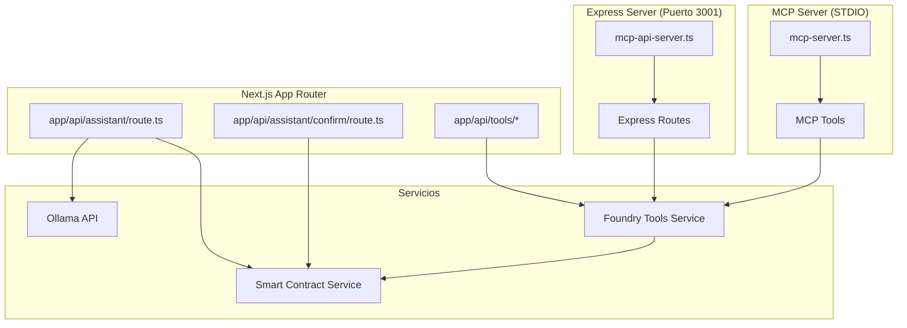

### 15. Flujo de Autenticación y Autorización

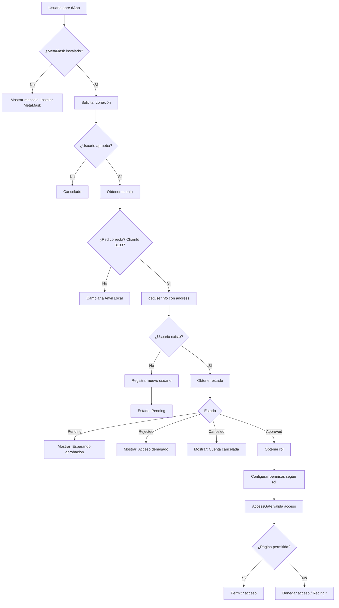

## 🗂️ Documentación Adicional

- `IA.md` - Retrospectiva completa del uso de IA en el desarrollo
- `chats/` - Logs de sesiones de desarrollo con IA

## 📝 Licencia

MIT

---

## 📊 Arquitectura del Contrato

### Estructura de Token
```solidity
struct Token {
    uint256 id;
    address creator;
    string name;
    uint256 totalSupply;
    string features;          // JSON string con características
    TokenType tokenType;      // Enum: API_MP, BOM, PT_LOTE, SSCC, COMPLIANCE_LOG
    uint256[] parentIds;      // IDs de tokens padres
    uint256[] parentAmounts;  // Cantidades de cada padre
    uint256 dateCreated;
    bool recall;              // Indica si el token está retirado (recall)
}
```

### Flujo de Creación de Lote (PT_LOTE)
1. Usuario selecciona receta (BOM) como padre único
2. Especifica cantidad de unidades del lote
3. Frontend valida:
   - Que tenga exactamente un padre
   - Que el padre sea una receta (BOM)
   - Que haya suficientes componentes disponibles
4. Contrato valida y descuenta componentes automáticamente

---

## 🔄 Sistema de Descuento de Supply para Lotes

Cuando se crea un lote (PT_LOTE) que tiene como padre una receta (BOM):

1. **Validación automática**: El sistema verifica que hay suficientes componentes disponibles
2. **Cálculo de necesidades**: Para cada componente, calcula `cantidadNecesaria = cantidadPorUnidad * cantidadLote`
3. **Verificación de balances**: Comprueba que el balance disponible sea suficiente para todos los componentes
4. **Descuento automático**: Si todo está bien, descuenta los balances de todos los componentes automáticamente
5. **Mensajes descriptivos**: Si falta algún componente, muestra exactamente qué componente falta y cuánto se necesita

### Ejemplo
Si una receta requiere:
- 10 unidades de Componente A por unidad de producto
- 5 unidades de Componente B por unidad de producto

Y quieres crear un lote de 100 unidades:
- Necesitarás: 1000 unidades de A y 500 unidades de B
- El sistema verificará que tengas estos balances disponibles
- Si faltan, mostrará un mensaje claro indicando qué falta
- Si todo está bien, descontará automáticamente 1000 de A y 500 de B de tus balances

---

## 🚨 Sistema de Recall (Retiro de Productos) - Enero 2025

### Funcionalidad de Recall
El sistema permite marcar productos como retirados del mercado (recall) cuando se detectan problemas de calidad o seguridad.

#### Características
- **Campo `recall` en struct Token**: Indica si un token está retirado del mercado
- **Solo para COMPLIANCE_LOG**: El recall solo puede aplicarse a tokens de tipo COMPLIANCE_LOG
- **Requiere exactamente un padre**: Un recall debe tener exactamente un token padre
- **Marcado de cadena completa**: Al crear un recall, se marca toda la cadena de suministro relacionada como retirada
- **Bloqueo de transferencias**: Los tokens retirados no pueden ser transferidos
- **Bloqueo de uso como padre**: Los tokens retirados no pueden usarse como padres en la creación de nuevos tokens

#### Interfaz de Usuario
- **Checkbox de Recall**: Visible solo cuando se selecciona tipo COMPLIANCE_LOG en la creación de tokens
- **Popup de advertencia**: Al intentar crear un token con recall, se muestra un popup explicando las consecuencias
- **Indicador visual "Retirado"**: Badge rojo en todas las vistas donde se muestran tokens:
  - Dashboard (lista de tokens)
  - Página de productos (lista de tokens)
  - Vista de información del token
  - Árbol de jerarquía
- **Icono de información para consumidores**: 
  - Aparece junto al badge "Retirado" solo para usuarios con rol consumidor
  - Al hacer clic, muestra un popup con:
    - Explicación clara pero no alarmista
    - Pasos a seguir para el consumidor
    - Instrucciones sobre qué hacer con el producto retirado

#### Mejoras en Jerarquía
- **Visualización de múltiples padres**: Todos los padres de un BOM se muestran en el mismo nivel usando BFS (Breadth-First Search)
- **Indicadores visuales**: Muestra cuando hay múltiples padres en el mismo nivel

---

*Desarrollado con asistencia de Claude (Anthropic) en Cursor IDE*
*Última actualización: Enero 2025*
